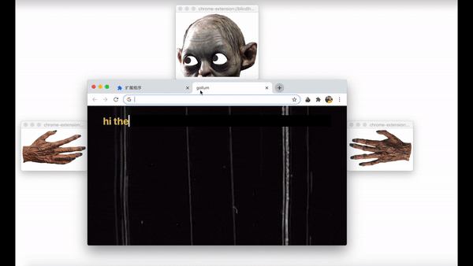

# Gollum

## Introduction
More and more people nowadays have been fixated on browsing the internet and interacting with others on social media platforms. The web and the service providers do benefit us in several aspects. Nonetheless, all the convenience brought are based on the recorded information that we voluntarily/involuntarily give to the service providers. We are constantly being watched by someone no matter what we are doing. Inspired by Netflix’s original docudrama **The Social Dilemma**, this project aims to empower people with a sense of alertness while browsing the web through a physical presence of the gollum that is always watching your action and commenting on your action/inactions.
**Warning:May bring a feeling of discomfort, and this is what we aim at :)**
[Click here to download!](https://github.com/selinachang819/abc-student-repo/raw/master/projects/project-b/gollum.zip)

## Process and Challenges
We found it extremely difficult at first since we were borrowing source code from Chino Kim and we didn’t quite understand his coding logic and the chrome extension APIs he used(system.display and chrome.windows). Simply copying the code didn’t work, so we both tried to ask Leon for help and look for the API documentation online to make sense of things. It turned out that once we were able to understand, we were able to debug and make changes.
The other one is the consistency between the features of our extension and the concept we try to convey. At first we came up with four features that echo our idea of someone constantly watching you and manipulating contents on user’s page: 1) animation whenever user open or close a tab 2) having gollum’s eyes follow the mouse cursor 3) having gollum commented on every action of user’s mouse 4) reverse text on the page. Nonetheless, it turned out that 4) was a feature that conveys the message yet quite annoying, we had no choice but to give up on this. 1) also seemed to be inconsistent and disconnected with the concept of gollum, so we changed it to a custom intro page every time a user opens a new tab. 3) is not so noticeable since we initially put the comments in the little popup on the top-right corner.  Then we changed it to have gollum actually speak whenever user’s click something on the page, and when gollum detects users’ inaction for more than 1 minute. In this way, the interaction becomes more explicit and noticeable.
